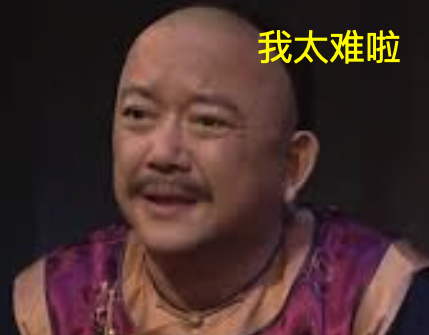
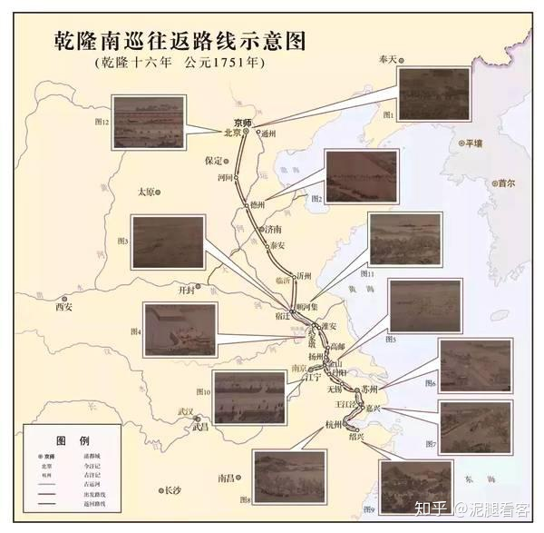
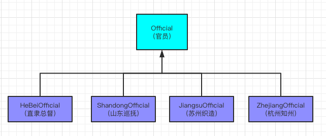
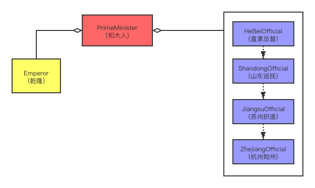

# 责任链设计模式

## 前言
对于已经工作了的小伙伴，你八成是见过"责任链"这种面向对象的设计模式的，还在上学的小伙伴也不用着急，你迟早会接触到的。本文旨在让小白同学和
不太熟悉责任链的朋友能够迅速对这一设计模式有一个大致的了解。

在我们的工农业生产中，经常有这样的场景：一个任务、事务、流程等都需要很多不同的步骤，来完成不同的计算或者收集不同的数据。为了维护一个比较复杂，
有时甚至是对顺序敏感的任务流程，我们经常在代码的编写和设计上采用"责任链"设计模式。究竟什么是"责任链"呢？咱们看下面这个例子

## 例子
假设你也"穿越"到了清朝，是会写代码的和珅和中堂，皇上马上要南巡。请你用代码封装并模拟："乾隆下江南" 这件事。你要怎么安排万岁爷的行程？要知道
这可是个大工程，中间可不能有差错，一旦出了什么岔子可是要
掉脑袋的😂 但皇上又是性情中人，行程可能经常更改，甚至半路就微服私访。所以我们在伺候皇上下江南的时候，既得让皇上的行程有序进行，又要尽量
适应圣上由于一时兴起而可能做出的变化。怎么设计呢？如果把皇上的行程都写在一起执行，有两个不好的地方：1、行程太多，而且全都事关重大，这么远的路，
全都要你一个人打理，哪里一不注意出了乱子，脑袋就要搬家。2、行程多，所以增改起来太麻烦，一旦有改动圣上的行程表容易乱。毕竟行程写在一起，好似
一堆乱麻，条理不清。所以问题来啦，和大人您可怎么排圣上的行程呢？  

  

和大人莫急，看看地图我们就知道，乾隆从北京到杭州要顺序经过直隶、山东、江苏、浙江四省（基本就是现在京沪高铁的路子）:

  

这样和大人就可以按省把任务大致划分为四个部分，责成四省的官员们
分担这一个大工程，把他们应尽的的责任连成一个有序的链条，然后一依次让他们执行伺候皇上的任务，这样一来解决了行程过于丰富，和大人一个人安排
不过来的问题，还保证了各个步骤的灵活安排（后面的例子讲），而且哪一步出了问题还便于问责（甩锅，否则全是自己的错）。好了，说了这么多，现在切入技术层面。  

- 总结一下我们所研究的问题中的名词，来确定大概需要哪些类：1、皇帝（乾隆）2、行程的管理者（和中堂）3、各省官员（具体干活的公仆们）
- 各个类之间的关系：最容易看出来的是各省官员是同僚关系，他们都要接待乾隆，只是在皇上南巡的过程中出场顺序和做的具体接待行为不一样，比如：
直隶总督会带乾隆去避暑山庄，山东巡抚会张罗着皇上祭拜孔庙；苏州织造让皇上游览园林；而杭州知州就带着皇上去西湖苏堤。这里告诉大家OOD中一个
优化设计的小口诀：**变化的抽接口，相同的建模版**。所以我们在这里面对官员们不同的行为，最好把他们抽象成接口或者抽象类，这里我们采用官员（Official）
这个抽象类。而和大人作为总管，他既要掌握皇帝的动向，又要辖制各省官员，所以在类的层面上和大人（PrimeMinister）这个类就得有指向皇帝（Emperor）
和官员列表的引用。 下面上UML图：  

## UML图
各省同僚：  
  
而你和大人，作为乾隆面前的红人，得统筹安排皇帝的行程，既要挟持皇帝，又要掌管各省官员，让他们有序地执行任务：  
  
责任链一般都至少有一个被处理的对象，作为参数传入各个步骤，这里的乾隆就是这个被处理（伺候）的对象。

## 代码
作为官员这个抽象类，我们考虑到实际情况，他要安排一个地方并陪同皇帝参观、游览, 其实就是一句话：伺候皇上。所以他有一个抽象方法serve，接受皇帝
（Emperor）这个对象
```java
@Data
public abstract class Official {
    protected String title;
    
    protected abstract void serve(Emperor emperor);
    
    @Override
    public String toString() {
        return title;
    }
}
```
这里为了区别不同的官员，我们还给了官员（Official）类一个成员变量title  
Official下面有具体实现的类，代表各省官员，他们自己有自己具体的方式去服务吾皇，比如直隶总督，他是这么干的：
```java
public class HebeiOfficial extends Official {

    public HebeiOfficial() { 
        this.title = "直隶总督";
    }

    @Override
    protected void serve(Emperor emperor) {
        emperor.play(this, "避暑山庄");
    }
}
```
这里在serve里面完全让参数"皇帝"自己决定怎么玩，（顺便说句题外话，这种让参数这个"外来的和尚"念经的方式，在各种设计模式里很常见。如果把这里的
Emperor换成Comparator，相信很多小伙伴就感觉有点像策略模式了。而且"直隶总督"也可以在皇帝play之前或者之后分别做一些事情，这像不像用JDK
的代理的时候中那个InvocationHandler对待Method的方式？或者Spring中对于Aspect的处理？另外在Visitor等设计模式中你也能看到这种写法的身影）
其他官员的写法类似，只是换个地方供皇帝游览而已，参见后面的输出结果，这里略。  
而作为皇帝，乾隆只管着玩就好，当然了，你和中堂可以安排当地的官员陪同，所以
皇帝类只有一个play方法, 这里用一个字符串简单表示去游览的地方。为了防止乾隆南下期间有人在北京"另立新君"（执行 new Emperor()），这个"皇帝"
对象的创建过程采用了单例模式，保证整个JVM里面就只有这么一个皇上，而且名字叫"乾隆"：
```java
public class Emperor {
    private static final Emperor INSTANCE = new Emperor("乾隆");
    private final String name;
    
    private Emperor(String name) {
        this.name = name;
    }
    
    public static Emperor getInstance() {
        return INSTANCE;
    }
    
    public void play(Official official, String place){
        System.out.println(official.getTitle() + " 安排 " + name + "皇帝游览了: " + place);
    }
}
```
而你，和珅和大人，只需要按各省顺序，合理安排好下面的官员，然后请出皇上并昭告天下：圣上下江南了，沿途各省小心伺候就好：
```java
public class PrimeMinister {
    private static List<Official> list = new ArrayList<>();
    
    public static void main(String[] args) {
        // 下令沿途各省官员准备好
        list.add(new HebeiOfficial());
        list.add(new ShandongOfficial());
        list.add(new JiangsuOfficial());
        list.add(new ZhejiangOfficial());
        // 请出皇上
        Emperor emperor = Emperor.getInstance();
        // 昭告天下：万岁爷起驾下江南！沿途各省依次伺候圣上
        System.out.println("乾隆下江南!");
        start(list, emperor);
    }
    
    private static void start(List<Official> officials, Emperor emperor) {
        for (Official o : officials) {
            o.serve(emperor);
        }
    }
}
```
看看，你的任务是不是简明多了，只需要维护好这个沿途各省官员的花名册即可。更重要的是，你不用亲自负责了，下面的人谁办事不力，就要谁的脑袋！
只要自己的这个"花名册"或者"行程表"没写错，咱的脑袋就算保住啦。而且各个官员的任务也比较单一，他们自己也更不容易出错。下面是整个行程模拟的执行
情况：
```
乾隆下江南!
直隶总督 安排 乾隆皇帝游览了: 避暑山庄
山东巡抚 安排 乾隆皇帝游览了: 曲阜孔庙
苏州织造 安排 乾隆皇帝游览了: 苏州园林
杭州知州 安排 乾隆皇帝游览了: 西湖苏堤
```
嗯，一切看上去似乎还不错，各省官员按照顺序，依次完成了任务，把万岁爷伺候的还不错，没有什么异常状况发生，总算松了口气。
但是，现在来了个突发情况：皇上突然要求，在路过山东的时候加一个环节 ----- 大明湖畔三日游！为啥要特意去那里？咱也不敢问呐！只管准备就好。  

   

幸好我们的行程又已经有了大致框架，赶紧查，大明湖那里归谁管，哦，济南知府，就是他了！现在只需把他也加到"花名册"：责令济南知府安排皇上在
大明湖畔三天的行程，不得有误，否则拿你试问！下面是和大人这边要做的改动：
```java
    ...以上略...
    list.add(new HeibeiOfficial());
    // 加入济南知府，让他干活，他知道在大明湖畔该怎么玩
    list.add(new JinanOfficial());
    list.add(new ShandongOfficial());
    list.add(new JiangsuOfficial());
    list.add(new ZhejiangOfficial());
    ...以下略...
```
而另一边济南知府这里，他也是属于官僚体制了（Official的子类），所以也要极尽所能，让圣上在大明湖畔玩得开心：
```java
public class JinanOfficial extends Official{
    public JinanOfficial() {
        title = "济南知府";
    }
    
    @Override
    protected void serve(Emperor emperor) {
        emperor.play(this, "大明湖畔");
    }
}
```
再次执行程序，模拟圣上的行程，结果输出如下：
```
乾隆下江南!
直隶总督 安排 乾隆皇帝游览了: 避暑山庄
济南知府 安排 乾隆皇帝游览了: 大明湖畔
山东巡抚 安排 乾隆皇帝游览了: 曲阜孔庙
苏州织造 安排 乾隆皇帝游览了: 苏州园林
杭州知州 安排 乾隆皇帝游览了: 西湖苏堤
```
嗯，这下总算又迎合了圣意，以后皇上再来什么其他的行程也不怕了（只要他不微服私访。微服私访您找纪晓岚去啊，单一责任原则，专门的类干
专门的事儿不是？），只要找到当地具体的官员，一纸命令：你给我极尽所能招待皇上，具体怎么招待，你看着办，伺候不好万岁爷，我要你脑袋！
当然了，皇帝也可能临时删掉南巡中的某个环节，我们直接把它从行程列表中删除就好，而且什么时候想再重新加进来还可以随时添加，做到了可以
"灵活插拔"，把代码的改动减到了最小，有新的业务逻辑加进来的时候，只是做添加，这样既不容易出错，也确保了代码的弹性扩展。而且如果是我们的真实项目，
我们甚至可以把工作步骤的列表配置在Spring Boot的配置文件里，开启流程的这个类，只要读取配置，然后把各个步骤依次执行。这样如果有修改只要改动配置文件即可，
在Java代码里无需任何改动。

## 总结与拓展
以上其实只是一个责任链模式最简单的应用，它是一个有序列表里面装了各个任务的步骤，然后依次运行到最后。我们可以把它写在自己的程序里，也可以把它
抽象出来做成产品，让其他人自由扩展与配置，尽量减少重复制造轮子。有很多工作流引擎便是这样，比如Activiti、Netflix的Conductor等。不光这些，就连你
最常用的SpringMVC甚至是Tomcat都用到了责任链模式，只不过他们的责任链是双向的，分别处理请求和响应，而且他们的处理顺序是刚好相反的，本质上是
用类似递归的方法正序倒序各便历了一次（Filter或Interceptor的）数组。另外在一些持续集成和持续部署的框架中，如Jenkins，会有管道（Pipeline）的概念，
当你在做出 `git push` 提交代码之后，会触发整个流程开始一步步地运作：拉取代码（Checkout code）、构建（Build）、测试（Test）等，直到部署（Deploy）完成并
运行脚本关闭旧版本的服务并启动最新部署的服务。这个"流水线"(Pipeline)其实也是一个可以让你用代码脚本来配置的责任链。没有责任链模式的应用，
你甚至都无法运行任何一个Java程序。因为类加载一般遵循"双亲委派"机制，实际上是用类似递归的方法正序和倒序各便历了一次Classloader类所构成的链表（
题外话，想把一个链表翻转过来，可以参见一道算法题：Leetcode 206），只不过其中的逻辑比较复杂，而且还应用了"模板方法"这一设计模式。
由于本文只是做一个责任链模式的简单入门，这些不做过多展开了。  

综上，充分理解和应用责任链设计模式，对我们的日常工作和阅读源码都很有帮助，能让我们有效提高代码的扩展性和可读性。希望你也可以在学习和实际项目中熟练应用