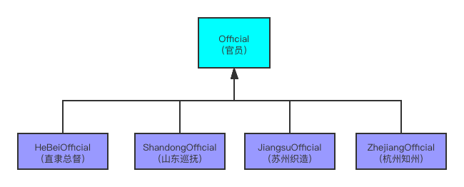
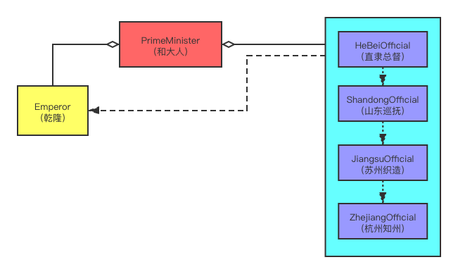

# 责任链设计模式

## 前言
在我们工农业生产中，经常有这样的场景：一个任务、事务、流程等都需要很多不同的步骤，来完成不同的计算或者收集不同的数据。为了维护一个比较复杂，
有时甚至是对顺序敏感的任务流程，我们经常在代码的编写和设计上采用"责任链"设计模式。究竟什么是"责任链"呢？咱们看下面这个例子

## 例子
假设你也穿越到了清朝，是会写代码的和珅和中堂，皇上要南巡，请你用代码封装："乾隆下江南" 这件事。你怎么安排万岁爷的行程？要知道这可是个大工程，
中间可不能有差错，一旦出了什么岔子可是要
掉脑袋的😂 但皇上又是性情中人，行程可能经常更改甚至半路就微服私访。所以我们在伺候皇上下江南的时候，既得让皇上的行程有序进行，又要尽量
适应圣上可能的变化。怎么设计呢？如果把皇上的行程都写在一起，有两个不好的地方：1、行程太多，本身就不好维护。2、行程增改起来太麻烦，一旦有改动
圣上的行程表容易乱。毕竟行程写在一起，条理不清，万一顺序错了呢？和大人您可怎么排圣上的行程呢？  

我们已经知道，乾隆从北京到杭州要顺序经过直隶、山东、江苏、浙江四省。这样和大人就可以按省把任务大致划分为四个部分，责成四省的官员们分担这一个
大工程，把他们应尽的的责任连成一个有序的链条，然后一依次让他们执行伺候皇上的任务，这样一来解决了行程过于丰富，和大人一个人安排不过来的问题，
还保证了各个步骤的有序性，而且哪一步出了问题还便于问责（甩锅，否则全是自己的错）。好了，说了这么多，现在切入技术层面。  

- 总结一下我们所研究的问题中的名词，来确定大概需要哪些类：1、皇帝（乾隆）2、行程的管理者（和中堂）3、各省官员（具体干活的公仆）
- 各个类之间的关系：最容易看出来的是各省官员是同僚关系，他们都要接待乾隆，只是在皇上南巡的过程中出场顺序和做的具体接待行为不一样，比如：
直隶总督会带乾隆去避暑山庄，山东巡抚会张罗着皇上祭拜孔庙；苏州织造让皇上游览园林；而杭州知州就带着皇上去西湖苏堤。这里告诉大家OOD中一个
优化设计的小口诀：“变化的抽接口，相同的建模版”。所以我们在这里面对官员没不同的行为，最好把他们抽象成接口护着抽象类，这里我们采用官员（Official）
这个抽象类。而和大人作为总管，他既要掌握皇帝的动向，又要辖制各省官员，所以在类的层面上和大人（PrimeMinister）这个类就得有指向皇帝（Emperor）
和官员列表的引用。 下面上UML图：  

## UML图
各省同僚：  
  
你作为和大人，统筹安排皇帝的行程，既要挟持皇帝，又要掌管各省官员让他们有序地执行任务（还得欺上瞒下、中饱私囊）：  
  

## 代码
作为官员这个抽象类，我们考虑到实际情况，他要安排一个地方并陪同皇帝参观、游览, 其实就是一句话：伺候皇上。所以他有一个抽象方法serve，接受皇帝
（Emperor）这个对象
```java
protected abstract void serve(Emperor emperor);
```
下面有具体的类，代表各省官员，他们自己有自己具体的方式去服务吾皇，比如直隶总督是这么干的：
```java
public class HeibeiOfficial extends Official {

    public HeibeiOfficial() { 
        this.title = "直隶总督";
    }

    @Override
    protected void serve(Emperor emperor) {
        emperor.play(this, "避暑山庄");
    }
}
```
这里在serve里面完全让参数"皇帝"自己决定怎么玩，（顺便说句题外话，这种让参数这个"外来的和尚"念经的方式在各种设计模式里很常见，如果把Emperor换成
Comparator，相信很多小伙伴就感觉有点像策略模式了。而且"直隶总督"也可以在皇帝play之前或者之后分别做一些事情，这像不像用JDK的代理的时候中那个
InvocationHandler对待Method的方式？或者Spring中对于Aspect的处理？另外在Visitor等设计模式中你也能看到这种写法的身影）其他官员的写法类似，
只是换个地方供皇帝游览而已，略。  
而作为皇帝，乾隆只管着玩就好，当然了，你和中堂可以安排当地的官员陪同，所以
皇帝类只有一个play方法, 这里用一个字符串简单表示去游览的地方。为了以防万一，这个类的创建方式采用了单例模式，保证整个JVM里面就只有这么一个皇上，
而且名字叫"乾隆"：
```java
public class Emperor {
    private static final Emperor INSTANCE = new Emperor("乾隆");
    private final String name;
    
    private Emperor(String name) {
        this.name = name;
    }
    
    public static Emperor getInstance() {
        return INSTANCE;
    }
    
    public void play(Official official, String place){
        System.out.println(official.getTitle() + " 安排 " + name + "皇帝游览了: " + place);
    }
}
```